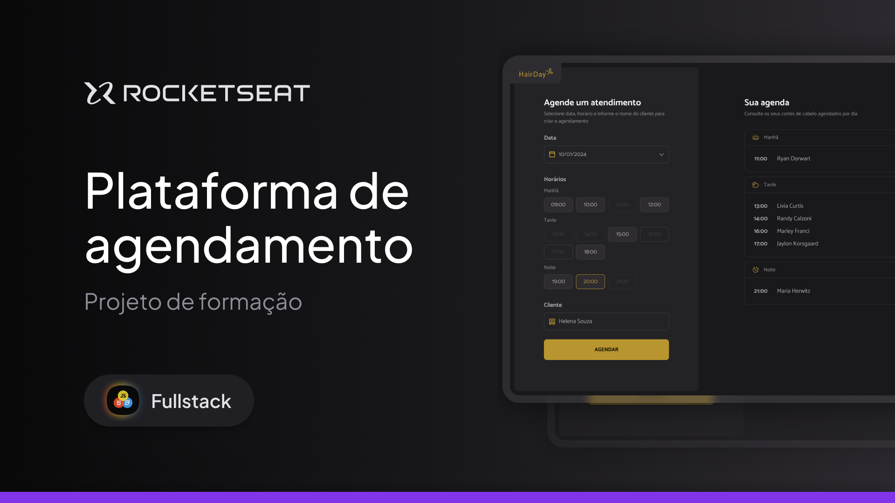

<h1 align="center">Hair Day</h1>

<p align="center">
  <a href="#-technologies">Technologies</a>&nbsp;&nbsp;&nbsp;|&nbsp;&nbsp;&nbsp;
  <a href="#-project">Project</a>&nbsp;&nbsp;&nbsp;|&nbsp;&nbsp;&nbsp;
  <a href="#-how-to-run-the-project">How to run the project</a>&nbsp;&nbsp;&nbsp;|&nbsp;&nbsp;&nbsp;
  <a href="#layout">Layout</a>
</p>

<br>

<p align="center">
  
</p>

## 🚀 Technologies

This project was developed with the following technologies:


## 💻 Project

Hair Day is a web application that simulates appointments. It's built using pure HTML, CSS, and JavaScript without any framework.

##  Layout

You can view the project layout through [FROM THIS LINK](https://www.figma.com/design/R475mk70eds5y7jm7QRH7T/Plataforma-de-agendamento--Community-?node-id=915-685&t=oldnqIDMvPrQWfk5-1). It is necessary to have an account on
 [Figma](https://figma.com) to access it.

## 🚀 How to run the project

Follow the steps below to install the dependencies, start the server, and run the application:

```bash
# 1. Install the project dependencies.
npm i

# 2. Start the local server
npm run server

# 3. to be served in a production environment
npm run build

# 4. Run the application in a development environment.
npm run dev
```
---

Made by : [Augusto Valerio](https://github.com/Augusto-Valerio).
